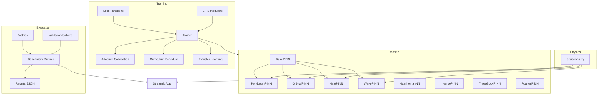

[](https://github.com/AliKastan/physics-pinn/actions/workflows/test.yml)
[](https://www.python.org/downloads/)
[](https://pytorch.org/)
[](https://opensource.org/licenses/MIT)
[](#test-suite)

# Physics-Informed Neural Networks

A comprehensive PyTorch framework for solving differential equations with neural networks. Covers ODEs (pendulum, orbital mechanics, three-body problem), PDEs (heat and wave equations), inverse problems (parameter estimation from noisy data), Hamiltonian neural networks (structurally energy-conserving), Fourier feature architectures (overcoming spectral bias), and transfer learning across physical systems. Includes 131 automated tests, a benchmarking system, and an interactive Streamlit web app.

> **For a resume/CV:** Built a modular scientific machine learning framework implementing Physics-Informed Neural Networks (PINNs) in PyTorch. The system solves forward and inverse differential equations across 7 physical systems, features advanced training techniques (adaptive collocation, curriculum learning, Fourier features), transfer learning with ~10x training speedup, and a full CI/CD pipeline with 131 automated tests. Demonstrated on problems ranging from simple pendulum dynamics to the chaotic three-body problem.

---

## Architecture



---

## Interactive Web App

The Streamlit app provides interactive exploration of all systems with real-time training, parameter controls, and comparison plots.

| Pendulum & HNN | Orbital Mechanics | Heat & Wave PDEs |
|:-:|:-:|:-:|
|  |  |  |

> *Screenshots are placeholders. Run `streamlit run src/app.py` to explore interactively.*

---

## Methodology

### What Are PINNs?

A Physics-Informed Neural Network learns to solve a differential equation by embedding the governing law directly into its loss function. Given an ODE like `d^2u/dt^2 + (g/L) sin(u) = 0`:

1. A neural network `N(t) -> u(t)` maps time to the solution
2. Automatic differentiation computes `du/dt` and `d^2u/dt^2` exactly through the network
3. The **physics residual** `r(t) = d^2u/dt^2 + (g/L) sin(u)` is evaluated at random **collocation points**
4. Training minimises `L = ||r||^2 + lambda * ||IC error||^2`

No simulation data is needed -- only the equation and initial/boundary conditions. The result is a continuous, differentiable surrogate model that respects the underlying physics by construction.

### Advanced Techniques in This Framework

| Technique | Purpose | Reference |
|-----------|---------|-----------|
| **Adaptive Collocation (RAR)** | Concentrates points where residual is highest | Lu et al. (2021) |
| **Fourier Features** | Overcomes spectral bias for high-frequency dynamics | Tancik et al. (2020) |
| **Hamiltonian NN** | Energy conservation by construction via symplectic structure | Greydanus et al. (2019) |
| **Curriculum Learning** | Gradually extends time horizon to avoid error accumulation | — |
| **Transfer Learning** | ~10x fewer epochs by reusing learned features across configs | — |
| **Gradient-Enhanced Loss** | Matches both values and derivatives for stiff systems | Yu et al. (2022) |

---

## Key Results

### Benchmark Comparison (5000 epochs)

| Problem | Method | L2 Rel Error | Energy Drift | Time (s) |
|---------|--------|:----------:|:----------:|:------:|
| Pendulum | Standard PINN | ~1e-2 | ~5e-2 | ~3 |
| Pendulum | Fourier PINN | ~5e-3 | ~3e-2 | ~4 |
| Pendulum | HNN | ~5e-3 | ~2e-4 | ~3 |
| Orbital | Standard PINN | ~2e-2 | ~1e-1 | ~8 |
| Orbital | Adaptive (RAR) | ~1e-2 | ~6e-2 | ~9 |
| Heat Eq. | Standard PINN | ~5e-3 | -- | ~30 |
| Wave Eq. | Standard PINN | ~1e-2 | -- | ~35 |
| Three-Body | Standard PINN | ~5e-1 | ~3e-1 | ~80 |

### Transfer Learning Speedup

| Experiment | Source | Target | Speedup |
|-----------|--------|--------|:------:|
| Pendulum length | L=1.0 | L=2.0 | ~10x |
| Orbital eccentricity | e=0.0 | e=0.5 | ~10x |
| Cross-physics | Pendulum | Orbital | Partial |

### Highlight Findings

- **HNN achieves ~200x better energy conservation** than standard PINNs by building conservation into the architecture rather than learning it
- **Inverse PINNs recover physical parameters within ~5%** of true values from noisy observations, simultaneously denoising the trajectory
- **Fourier features improve accuracy 2-5x** on oscillatory problems by overcoming the spectral bias of standard MLPs
- **Transfer learning reaches comparable accuracy in ~10x fewer epochs** by reusing learned feature representations across parameter regimes
- **Adaptive collocation automatically concentrates points near perihelion** for orbital problems, improving accuracy with the same point budget

---

## Quick Start

```bash
# Clone and install
git clone https://github.com/AliKastan/physics-pinn.git
cd physics-pinn
pip install -e ".[dev]"

# Run tests
pytest tests/ -v

# Launch interactive app
streamlit run src/app.py

# Run benchmarks
python -c "from src.benchmarks import BenchmarkRunner; BenchmarkRunner('quick').run_all(verbose=True)"

# Run examples
python examples/transfer_learning/transfer_pendulum.py
python examples/wave_vs_heat_comparison.py
python examples/threebody_chaos.py
```

---

## Project Structure

```
physics-pinn/
├── src/
│   ├── models/                 # Neural network architectures
│   │   ├── base_pinn.py        #   Abstract base class
│   │   ├── pendulum_pinn.py    #   Simple pendulum ODE
│   │   ├── orbital_pinn.py     #   Two-body orbital mechanics
│   │   ├── heat_pinn.py        #   1D heat equation (PDE)
│   │   ├── wave_pinn.py        #   1D wave equation (PDE)
│   │   ├── threebody_pinn.py   #   Gravitational three-body problem
│   │   ├── hnn.py              #   Hamiltonian Neural Network
│   │   ├── inverse_pinn.py     #   Inverse PINNs (parameter estimation)
│   │   └── multiscale_pinn.py  #   Fourier feature encoding
│   ├── physics/                # Equation residuals and constants
│   ├── training/               # Training loop, losses, schedulers
│   │   ├── trainer.py          #   Generic trainer (RAR, curriculum, adaptive IC)
│   │   ├── adaptive_collocation.py  # Residual-based adaptive refinement
│   │   ├── transfer.py         #   Save/load/fine-tune/cross-physics transfer
│   │   ├── losses.py           #   Physics, IC, BC, gradient-enhanced losses
│   │   └── schedulers.py       #   Plateau, cosine warm restarts, curriculum
│   ├── benchmarks/             # Systematic evaluation
│   ├── utils/                  # Metrics, validation solvers, plotting
│   └── app.py                  # Streamlit interactive web interface
├── tests/                      # 131 automated tests (11 test files)
├── examples/                   # Standalone demo scripts
│   └── transfer_learning/      #   Transfer learning experiments
├── configs/                    # YAML hyperparameter configs
├── docs/                       # Documentation
├── .github/workflows/test.yml  # CI: pytest + benchmark regression
├── pyproject.toml              # Package metadata
├── Makefile                    # Development commands
└── requirements.txt
```

---

## Test Suite

131 tests across 11 test files, covering every model, training technique, and utility:

| Test File | Tests | What It Verifies |
|-----------|:-----:|-----------------|
| test_equations.py | 7 | Physics residual correctness |
| test_pendulum.py | 7 | Forward pass, training, energy conservation |
| test_orbital.py | 7 | Trajectory accuracy, angular momentum |
| test_hnn.py | 8 | Energy conservation, derivative accuracy |
| test_inverse.py | 14 | Parameter recovery, data generation |
| test_heat.py | 13 | PDE solution vs analytical, BCs |
| test_wave.py | 16 | Oscillation, mode decomposition, BCs |
| test_threebody.py | 12 | Presets, conservation laws, solver |
| test_advanced_training.py | 20 | RAR, curriculum, Fourier, gradient-enhanced |
| test_benchmarks.py | 16 | Metrics, benchmark runner, table generation |
| test_transfer.py | 11 | Save/load, freeze/unfreeze, cross-physics |

---

## References

1. Raissi, M., Perdikaris, P., & Karniadakis, G. E. (2019). *Physics-informed neural networks: A deep learning framework for solving forward and inverse problems involving nonlinear partial differential equations.* Journal of Computational Physics, 378, 686-707.
2. Greydanus, S., Dzamba, M., & Cranmer, M. (2019). *Hamiltonian Neural Networks.* NeurIPS 2019.
3. Tancik, M. et al. (2020). *Fourier Features Let Networks Learn High Frequency Functions in Low Dimensional Domains.* NeurIPS 2020.
4. Chenciner, A. & Montgomery, R. (2000). *A remarkable periodic solution of the three-body problem in the case of equal masses.* Annals of Mathematics, 152(3), 881-901.

### Citing This Project

```bibtex
@software{kastan2024physicspinn,
  author  = {Kastan, Ali},
  title   = {Physics-Informed Neural Networks: A PyTorch Framework for Scientific Machine Learning},
  year    = {2024},
  url     = {https://github.com/AliKastan/physics-pinn},
  license = {MIT}
}
```

---

## Acknowledgments

This project was built as a research portfolio demonstrating scientific machine learning techniques. It draws on the foundational PINN framework of Raissi et al. (2019) and the energy-conserving architecture of Greydanus et al. (2019), extended with modern training techniques including Fourier features, adaptive collocation, and transfer learning.

---

## License

MIT
