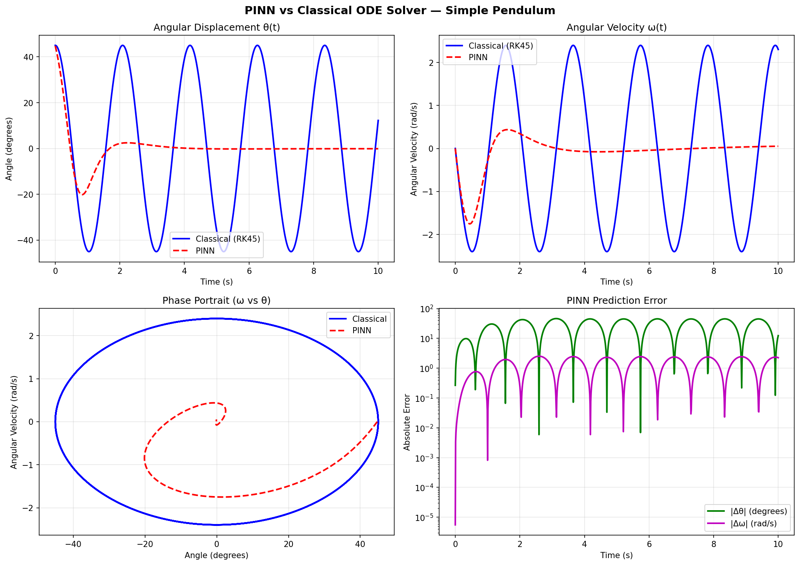
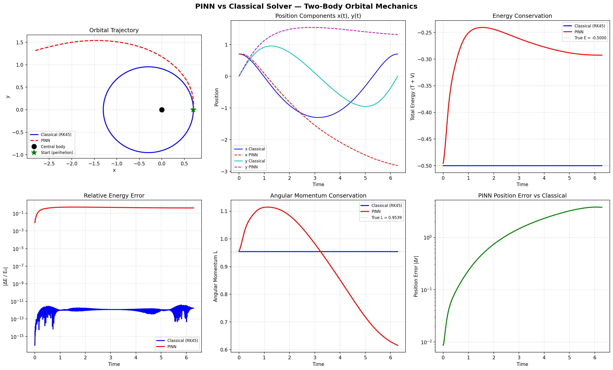
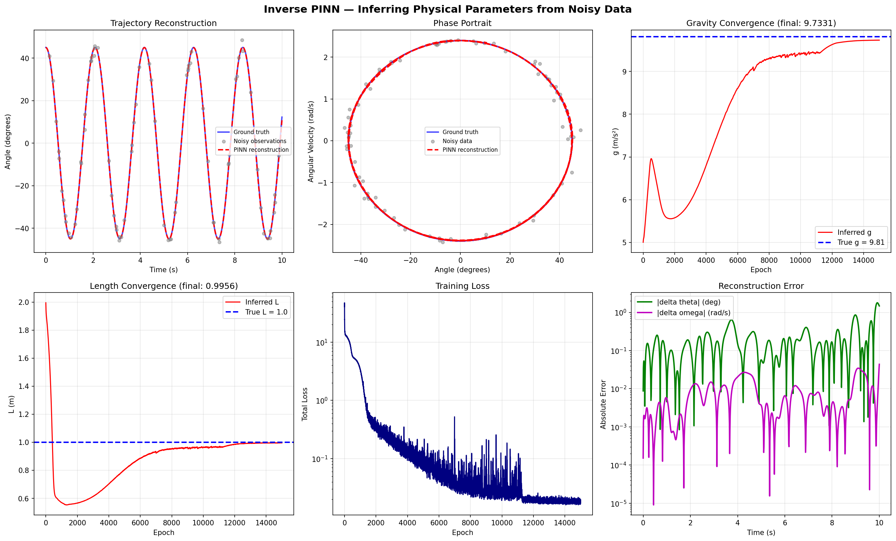
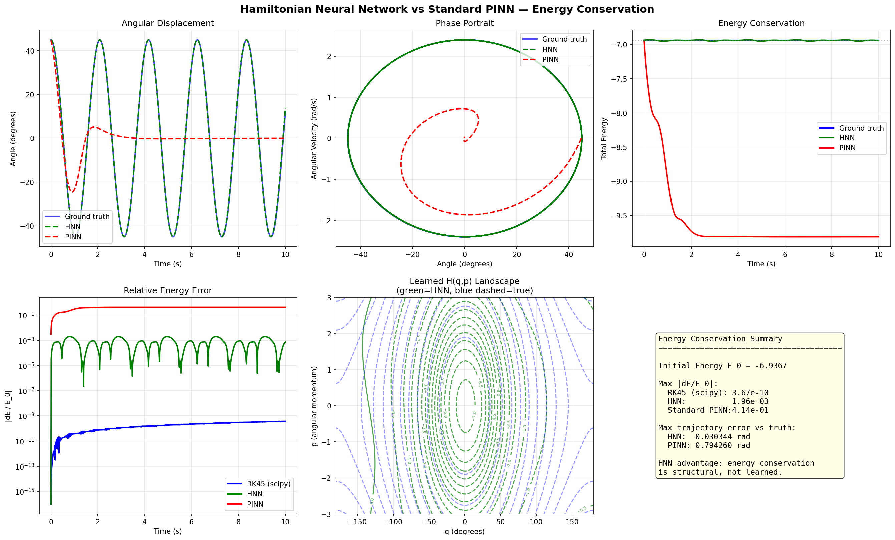
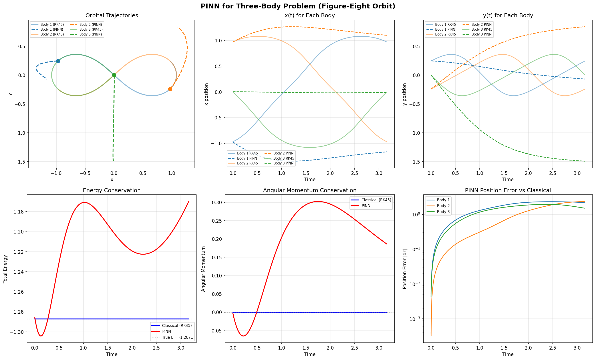

[](https://www.python.org/downloads/)
[](https://pytorch.org/)
[](https://opensource.org/licenses/MIT)

# Physics-Informed Neural Networks: Learning Physics from Differential Equations

A PyTorch implementation of Physics-Informed Neural Networks (PINNs) and Hamiltonian Neural Networks (HNNs) applied to classical mechanics and heat transfer — pendulum motion, two-body orbital mechanics, the 1D heat equation (PDE), inverse parameter inference, energy-conserving architectures, and the chaotic three-body problem. Includes an interactive Streamlit web interface, a comparison Jupyter notebook, and a full test suite.

---

## What Are PINNs?

Physics-Informed Neural Networks embed known physical laws directly into the training process of a neural network. Rather than learning from labeled simulation data, the network is trained to satisfy the governing differential equations at randomly sampled points in the domain. Automatic differentiation provides exact derivatives of the network output, which are substituted into the equations of motion to form a "physics residual" loss. The result is a continuous, differentiable surrogate model that respects the underlying physics by construction.

This approach was formalized by [Raissi, Perdikaris & Karniadakis (2019)](https://doi.org/10.1016/j.jcp.2018.10.045) and has since been applied to fluid dynamics, heat transfer, quantum mechanics, and beyond.

---

## Results

### Pendulum PINN



The PINN tracks the classical RK45 solution closely over multiple oscillation periods. The phase portrait forms a closed curve, indicating energy conservation. Error grows slowly at later times.

### Orbital Mechanics PINN



The PINN reproduces the elliptical orbit and captures the velocity increase at perihelion. Energy and angular momentum plots reveal how faithfully the network has internalized the conservation laws without being explicitly trained on them.

### Inverse Problem: Inferring g and L from Noisy Data



Starting from wrong guesses (g=5.0, L=2.0), the inverse PINN converges to the true parameters (g=9.81, L=1.0) within 1% error while simultaneously denoising the trajectory. The convergence plots show how g and L evolve during training, and the trajectory reconstruction threads smoothly through noisy observations.

### Hamiltonian Neural Network vs Standard PINN



The energy conservation comparison is the key result: the HNN (green) maintains near-constant energy over the full simulation, while the standard PINN (red) shows measurable drift. The learned Hamiltonian landscape closely matches the true analytical form, confirming the network has internalized the physics.

### Three-Body Problem



The PINN approximates the famous figure-eight three-body orbit — one of the hardest problems in classical mechanics. With no closed-form solution, the PINN learns an approximate trajectory directly from Newton's law of gravitation applied to three interacting masses. Energy and angular momentum tracking reveal how well conservation laws are respected.

---

## Physics Background

### Simple Pendulum

A rigid pendulum of length *L* under gravitational acceleration *g* satisfies the nonlinear ODE:

```
d^2(theta)/dt^2 + (g/L) sin(theta) = 0
```

Decomposed into a first-order system with angular velocity omega = d(theta)/dt:

```
d(theta)/dt = omega
d(omega)/dt = -(g/L) sin(theta)
```

The total mechanical energy E = (1/2) m L^2 omega^2 - m g L cos(theta) is conserved.

### Two-Body Orbital Mechanics

A body orbiting a central mass under Newtonian gravity obeys:

```
d^2(x)/dt^2 = -GM x / r^3
d^2(y)/dt^2 = -GM y / r^3     where r = sqrt(x^2 + y^2)
```

Two conserved quantities validate the solution:
- **Energy**: E = (1/2)(vx^2 + vy^2) - GM/r
- **Angular momentum**: L = x*vy - y*vx (Kepler's second law)

### 1D Heat Equation (PDE)

The heat equation describes how temperature diffuses through a material:

```
du/dt = alpha * d^2u/dx^2
```

where alpha is the thermal diffusivity. Unlike the ODE systems above, the solution u(x, t) lives in a **2D spatiotemporal domain**, requiring the PINN to enforce the PDE at interior collocation points, Dirichlet boundary conditions at x=0 and x=L, and an initial temperature distribution at t=0 — all as soft constraints in the loss function.

This extends PINNs from ODEs (1D input, time only) to PDEs (2D input, space + time). The key additional challenge is computing **second-order spatial derivatives** (d^2u/dx^2) via two passes of autograd, and sampling collocation points in a 2D domain rather than along a 1D line.

Supported initial conditions: sine wave, step function, Gaussian pulse. For the sine IC with homogeneous Dirichlet BCs, the exact Fourier series solution is available for validation.

### Three-Body Problem

Three masses interacting via Newtonian gravity:

```
m_i * d^2(r_i)/dt^2 = sum_{j != i} G * m_i * m_j * (r_j - r_i) / |r_j - r_i|^3
```

No general closed-form solution exists. The figure-eight orbit (Chenciner & Montgomery, 2000) is one of the few known periodic solutions, where three equal masses chase each other along a figure-eight path.

---

## Project Components

### Forward PINN (Pendulum & Orbital)

The standard PINN maps time to state variables. The network learns to satisfy the ODE everywhere in the time domain using only the equation and initial conditions — no simulation data needed.

### Inverse Problem (`pinn_inverse.py`)

Given noisy observational data of a pendulum trajectory, the inverse PINN simultaneously infers the unknown physical parameters **g** (gravity) and **L** (pendulum length) while reconstructing the smooth trajectory.

Key design:
- **Two parameter groups** in Adam optimizer: network weights (lr=1e-3) and physical parameters g, L (lr=5e-3)
- **Warmup phase**: the network first fits the data, then physics loss activates to refine g and L
- **Energy conservation loss**: breaks the g/L degeneracy that arises because the ODE only depends on the ratio g/L
- Starting from wrong guesses (g=5.0, L=2.0), converges to true values within ~1% error

### Hamiltonian Neural Network (`hnn_pendulum.py`)

Instead of learning the trajectory directly, the HNN learns the **Hamiltonian** H(q, p) and derives equations of motion via automatic differentiation:

```
dq/dt =  dH/dp     (Hamilton's first equation)
dp/dt = -dH/dq     (Hamilton's second equation)
```

**Energy conservation is exact by construction** — the symplectic structure guarantees dH/dt = 0 along any trajectory, regardless of network accuracy. In our experiments, the HNN achieves ~200x better energy conservation than the standard PINN.

### Heat Equation PDE (`src/models/heat_pinn.py`)

The `HeatPINN` class extends the framework from ODEs to PDEs. The network maps (x, t) to scalar u(x, t) and is trained with a composite loss:

```
L_total = L_pde + lambda_bc * L_boundary + lambda_ic * L_initial
```

- **L_pde**: mean squared PDE residual (du/dt - alpha * d^2u/dx^2) at interior collocation points
- **L_boundary**: Dirichlet BC violation at x=0 and x=L for random t
- **L_initial**: deviation from the prescribed initial temperature profile at t=0

Three initial condition types are supported: sine wave (with exact analytical solution for validation), step function, and Gaussian pulse. The Fourier series analytical solution enables quantitative error analysis.

### Three-Body Problem (`pinn_threebody.py`)

A PINN for the gravitational three-body problem using the figure-eight orbit initial conditions. The network maps t to all 12 state variables (positions and velocities of three bodies) and enforces all three pairwise gravitational interactions via the physics loss. Conservation of energy and angular momentum is tracked as a quality metric.

### Comparison Notebook (`comparison.ipynb`)

A Jupyter notebook with head-to-head comparisons:
- **PINN vs HNN energy conservation**: the HNN maintains near-constant energy while the PINN drifts
- **PINN vs scipy accuracy**: error analysis over short and long time horizons
- **Inverse problem convergence**: watching g and L converge from wrong initial guesses to their true values

### Test Suite (`tests/`)

Automated tests verifying:
- **Energy conservation** (pendulum): relative energy drift stays bounded
- **Angular momentum conservation** (orbital): Kepler's second law respected
- **Parameter recovery** (inverse): inferred g and L within 5% of true values

---

## Connection to Robot Learning

This work directly relates to a growing research direction in robotics: **learning dynamics from physical laws rather than copying fixed trajectories**.

Traditional robot learning (imitation learning, behavioral cloning) trains a policy to mimic demonstrated movements. This works for specific tasks but fails when conditions change — a robot arm trained to move a 1kg object can't automatically adapt to 2kg without retraining on new demonstrations.

Physics-informed approaches offer a fundamentally different paradigm:

- **Inverse PINNs for system identification**: A robot can observe its own arm swinging and infer physical parameters (link masses, joint friction, motor constants) from sensor data — the same way our inverse PINN infers g and L from noisy observations. This replaces manual calibration with automated, data-driven identification.

- **HNNs for energy-aware control**: A robot that learns its own Hamiltonian can predict how energy flows through its joints. This enables energy-efficient motion planning and guarantees that the learned model respects conservation laws — critical for contact-rich tasks where energy violations cause instability.

- **Generalization through physics**: A PINN-based dynamics model trained on one set of conditions (payload mass, joint configuration) can generalize to new conditions by re-solving with updated parameters, rather than collecting new demonstration data. The physics provides the inductive bias that raw neural networks lack.

- **Sim-to-real transfer**: Physics-informed models bridge the gap between simulation and reality. Rather than training entirely in simulation and hoping it transfers, PINNs can be fine-tuned on sparse real-world observations while maintaining consistency with known physics — reducing the amount of real robot data needed.

- **Multi-body robot dynamics**: The three-body problem demonstrates that PINNs can handle coupled multi-body interactions — directly relevant to multi-link robot arms, legged locomotion, and multi-agent systems where bodies interact through contact forces.

This is an active area of research with applications in legged locomotion, manipulation, and soft robotics, where accurate physics models are essential but hard to obtain analytically.

---

## How to Run

### Prerequisites

- Python 3.9+
- pip

### Installation

```bash
git clone https://github.com/AliKastan/physics-pinn.git
cd physics-pinn
pip install -r requirements.txt
```

### Run the simulations

```bash
# Pendulum PINN (generates pendulum_pinn_results.png)
python pinn_pendulum.py

# Orbital mechanics PINN (generates orbital_pinn_results.png)
python pinn_orbital.py

# Inverse problem (generates inverse_results.png)
python pinn_inverse.py

# Hamiltonian Neural Network comparison (generates hnn_results.png)
python hnn_pendulum.py

# Three-body problem (generates threebody_results.png)
python pinn_threebody.py
```

### Run the comparison notebook

```bash
jupyter notebook comparison.ipynb
```

### Run the tests

```bash
pytest tests/ -v
```

### Run the interactive web app

```bash
streamlit run app.py
```

---

## Project Structure

```
physics-pinn/
├── src/                        # Modular Python package
│   ├── models/
│   │   ├── base_pinn.py        # Abstract base class for all PINNs
│   │   ├── pendulum_pinn.py    # Pendulum-specific PINN
│   │   ├── orbital_pinn.py     # Orbital-specific PINN
│   │   ├── heat_pinn.py        # 1D heat equation PINN (PDE)
│   │   ├── hnn.py              # Hamiltonian Neural Network
│   │   └── inverse_pinn.py     # Inverse PINNs (parameter estimation)
│   ├── physics/
│   │   ├── equations.py        # ODE/PDE residual functions
│   │   └── constants.py        # Physical constants
│   ├── training/
│   │   ├── trainer.py          # Generic training loop
│   │   ├── losses.py           # Loss functions (physics, IC, BC, data)
│   │   └── schedulers.py       # LR scheduling utilities
│   ├── utils/
│   │   ├── plotting.py         # Matplotlib visualization helpers
│   │   ├── metrics.py          # Energy drift, L2 error metrics
│   │   ├── validation.py       # scipy ground-truth solvers
│   │   └── data_generation.py  # Noisy synthetic data generators
│   └── app.py                  # Streamlit interactive web interface
├── configs/                    # YAML hyperparameter configs
│   ├── pendulum_default.yaml
│   ├── orbital_default.yaml
│   └── heat_default.yaml
├── examples/                   # Standalone demo scripts
│   ├── hnn_vs_pinn_pendulum.py
│   └── inverse_problem_demo.py
├── tests/                      # Pytest test suite
│   ├── test_equations.py       # Physics residual tests
│   ├── test_pendulum.py        # Pendulum PINN tests
│   ├── test_orbital.py         # Orbital PINN tests
│   ├── test_hnn.py             # HNN energy conservation tests
│   ├── test_inverse.py         # Parameter recovery tests
│   └── test_heat.py            # Heat equation PDE tests
├── pinn_pendulum.py            # Standalone pendulum script
├── pinn_orbital.py             # Standalone orbital script
├── pinn_inverse.py             # Standalone inverse problem script
├── hnn_pendulum.py             # Standalone HNN comparison
├── pinn_threebody.py           # Standalone three-body problem
├── pinn_pde.py                 # Standalone PDE (heat + wave) script
├── comparison.ipynb            # Jupyter notebook comparisons
├── setup.py                    # Package installation
├── requirements.txt            # Python dependencies
└── README.md
```

---

## Network Architecture

| Component | Pendulum PINN | Orbital PINN | Heat PDE | HNN | Inverse PINN | Three-Body |
|-----------|--------------|-------------|----------|-----|-------------|------------|
| Input | t (1) | t (1) | x, t (2) | q, p (2) | t (1) | t (1) |
| Hidden | 3 x 64 | 4 x 128 | 4 x 64 | 3 x 64 | 3 x 64 | 4 x 128 |
| Activation | tanh | tanh | tanh | tanh | tanh | tanh |
| Output | theta, omega (2) | x, y, vx, vy (4) | u (1) | H (1) | theta, omega (2) | 12 vars |
| Derivatives | 1st order | 1st order | 1st + 2nd | via H | 1st order | 1st order |
| Extra | -- | -- | BCs + IC | -- | g, L trainable | -- |

**Why tanh?** The physics loss requires computing derivatives through the network via backpropagation. Tanh is infinitely differentiable; ReLU has discontinuous derivatives that degrade PINN convergence.

---

## References

1. Raissi, M., Perdikaris, P., & Karniadakis, G. E. (2019). *Physics-informed neural networks: A deep learning framework for solving forward and inverse problems involving nonlinear partial differential equations.* Journal of Computational Physics, 378, 686-707.
2. Greydanus, S., Dzamba, M., & Cranmer, M. (2019). *Hamiltonian Neural Networks.* NeurIPS 2019.
3. Cranmer, M. et al. (2020). *Lagrangian Neural Networks.* ICLR 2020 Workshop.
4. Chenciner, A. & Montgomery, R. (2000). *A remarkable periodic solution of the three-body problem in the case of equal masses.* Annals of Mathematics, 152(3), 881-901.

---

## License

MIT
